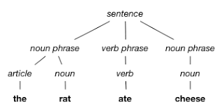

# M_CLI2.f90 and associated files



## NAME

### M_CLI2 - parse Unix-like command line arguments from Fortran

## DESCRIPTION

   M_CLI2(3f) is a Fortran module that will crack the command line when
   given a prototype string that looks very much like an invocation of
   the program. A call to get_args(3f) or one of its variants is then
   made for each parameter name to set the variables appropriately in
   the program.

## DOWNLOAD
   ```bash
       git clone https://github.com/urbanjost/M_CLI2.git
       cd M_CLI2/src
       # change Makefile if not using one of the listed compilers
     
       # for gfortran
       make clean
       make F90=gfortran gfortran
     
       # for ifort
       make clean
       make F90=ifort ifort

       # for nvfortran
       make clean
       make F90=nvfortran nvfortran
   ```
   This will compile the M_CLI2 module and build all the example programs.

## SUPPORTS FPM  
   Alternatively, download the github repository and build it with
   fpm ( as described at [Fortran Package Manager](https://github.com/fortran-lang/fpm) )

   ```bash
        git clone https://github.com/urbanjost/M_CLI2.git
        cd M_CLI2
        fpm build
        fpm test
   ```

   or just list it as a dependency in your fpm.toml project file.

```toml
        [dependencies]
        M_CLI2        = { git = "https://github.com/urbanjost/M_CLI2.git" }
```

## FUNCTIONAL SPECIFICATION

**This is how the interface works --**

* Pass in a string that looks like the command you would use to execute the program with all values specified.
  Now all the values in the prototype should be updated using values from the command line and ready to query.
* you read the results with the get_args(3f) procedure or one of its variants (if you want to use fixed length.
  CHARACTER variables or fixed-size arrays).

## RESPONSE FILES
[Response files](response.md) are supported as described in the documentation for
[set_args](https://urbanjost.github.io/M_CLI2/set_args.3m_cli2.html).
They are a system-independent way to create short abbreviations for long
complex commands. This option is generally not needed by programs with
just a few options, but can be particularly useful for programs with
dozens of options where various values are frequently reused.

## DOCUMENTATION
These demo programs provide templates for the most common usage:

- [demo1](example/demo1.f90) using the convenience functions
- [demo2](example/demo2.f90) putting everything including **help** and **version** information into a contained procedure.
- [demo3](example/demo3.f90) example of **basic** use
- [demo4](example/demo4.f90) _COMPLEX_ type values
- [demo5](example/demo5.f90) _CHARACTER_ type values
- [demo6](example/demo6.f90) a complicated example showing how to create a command with subcommands
- [demo7](example/demo7.f90) controlling array delimiter characters
- [demo8](example/demo8.f90) multiple keyword and variable pairs on get_args(3f) for limited cases
- [demo9](example/demo9.f90) long and short names using  --LONGNAME:SHORTNAME
- [demo10](example/demo10.f90) full usage and even equivalencing

### manpages
- [M_CLI2](https://urbanjost.github.io/M_CLI2/M_CLI2.3m_cli2.html)  -- An overview of the M_CLI2 module
- [set_args](https://urbanjost.github.io/M_CLI2/set_args.3m_cli2.html)  -- parses the command line options
- [get_args](https://urbanjost.github.io/M_CLI2/get_args.3m_cli2.html)  -- obtain parameter values for allocatable arrays and scalars
#### less frequently used 
- [get_args_fixed_length](https://urbanjost.github.io/M_CLI2/get_args_fixed_length.3m_cli2.html)  -- obtain parameter values for fixed-length character variable
- [get_args_fixed_size](https://urbanjost.github.io/M_CLI2/get_args_fixed_size.3m_cli2.html)  -- obtain parameter values for fixed-size arrays
- [specified](https://urbanjost.github.io/M_CLI2/specified.3m_cli2.html)  -- query whether an option was used on the commandline


### All manpages amalgamated
- [BOOK_M_CLI2](https://urbanjost.github.io/M_CLI2/BOOK_M_CLI2.html) -- All manpages consolidated using JavaScript

<!--
### doxygen

- [doxygen(1) output](https://urbanjost.github.io/M_CLI2/doxygen_out/html/index.html).
-->

## EXAMPLE PROGRAM

This short program defines a command that can be called like

```bash
   ./show -x 10 -y -20 --point 10,20,30 --title 'plot of stuff' *.in
   ./show -z 300
   # the unnamed values (often filenames) are returned as an array of strings
   ./show *
   # these parameters are defined automatically but you must supply text for --version to be useful.
   ./show --usage
   ./show --help
   ./show --version
```
```fortran
   program show
   use M_CLI2, only : set_args, get_args, files=>unnamed
   use M_CLI2, only : get_args_fixed_size
   implicit none
   integer :: i
   !! DEFINE ARGUMENTS
   real                          :: x, y, z, point(3)
   integer,allocatable           :: p(:)
   character(len=:),allocatable  :: title
   logical                       :: l, lbig
   !! DEFINE COMMAND
      call set_args('-x 1 -y 2.0 -z 3.5e0 --point -1,-2,-3 -p 11,-22,33 --title "my title" -l F -L F')
   !! GET VALUES
      call get_args('x',x, 'y',y, 'z',z, 'l',l, 'L', lbig) ! get scalar fixed-size variables
      call get_args_fixed_size('point',point) ! this will ensure three values are specified
      call get_args('p',p)
      call get_args('title',title)
   !! USE THE VALUES IN YOUR PROGRAM.

   !! OPTIONAL UNNAMED VALUES FROM COMMAND LINE
      if(size(files).gt.0)then
         write(*,'(a)')'files:'
         write(*,'(i6.6,3a)')(i,'[',files(i),']',i=1,size(files))
      endif
   end program show
```
## COMMIT TESTS ##

commit `598e44164eee383b8a0775aa75b7d1bb100481c3` was tested on 2020-11-22 with
 + GNU Fortran (GCC) 8.3.1 20191121 (Red Hat 8.3.1-5)
 + ifort (IFORT) 19.1.3.304 20200925
 + nvfortran 20.7-0 LLVM 64-bit target on x86-64 Linux

## FEEDBACK ##
-------
   Please provide feedback on the
   [wiki](https://github.com/urbanjost/M_CLI2/wiki) or in the
   [__issues__](https://github.com/urbanjost/M_CLI2/issues)
   section or star the repository if you use the module (or let me know
   why not and let others know what you did use!).
-------
